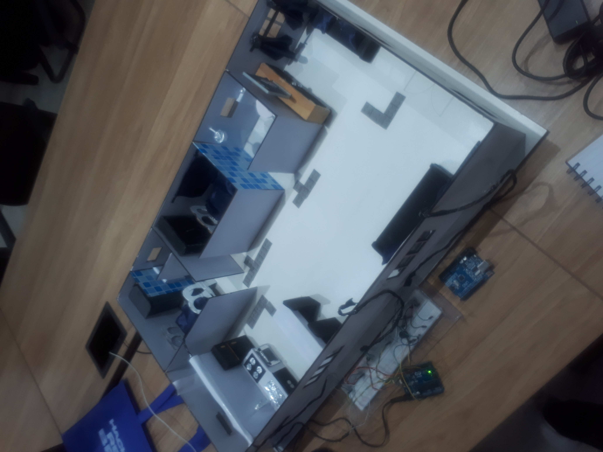
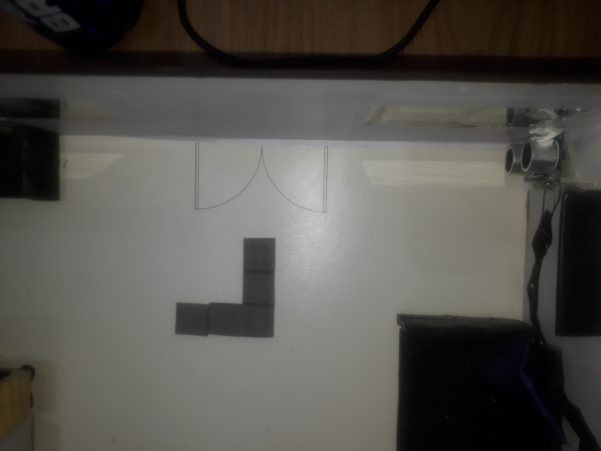

# Apartamento-inteligente-Projeto-INOVATIONN-PARADISE
## Projeto colegial mostrado na startup Hackathon Maceio/al

> Esse é meu primeiro repositorio no GITHUB,
esse foi um projeto que foi designado para um projeto de feira de ciencia de escola , acabou que acabou indo pra frente, depois acabei participando de uma startup de minha cidade apresentando esse projeto e estou disponibizando o codigo e atualizações sobre ele.

Esse projeto é designado para pessoas portadoras de deficiencia visual que traz um apartamento totalmente designado para esse tipo de deficiencia,trazendo uma area mais com facil acesso, com piso tatil e sensores de proximidade para afim de mais comodo,confiabilizade e lazer
Criamos planta 2d, 3d e uma maquete de como seria esse apartamento adaptado

A parte tecnologica estão na parte dos sensores de proximidade, que são sensores ultrasonicos que vão detectar quando alguem estiver nas entradas dos comodos, e em seguida enviar essas informações para o aplicativo desensvolvido desmostrando o sensor detectado, promovendo o total acesso do sensores ligado em cada comodo para o portador da deficiencia

Na maquete simulamos como colocamos os sensores para detectar presença no vão da porta e tambem utilizando o dispositivo Arduino para interligar e programar todos os sensores, além de enviar essas informações para o aplicativo via Bluetooth

IDEIAS FUTURAS
- Comandos de voz no aplicativo para cada comodo quando sensor for detectado
- Fazer com que o aplicativo tenha uma tradução para libras para atender tambêm atender portadores de deficiencia auditiva (Ideia 0 custo adicional)
- Mudando o protocolo de transferencia para WIFI já que Bluetooth esta ficando cada vez mais obsoleto
- Melhorar layout do aplicativo
- 
- 

