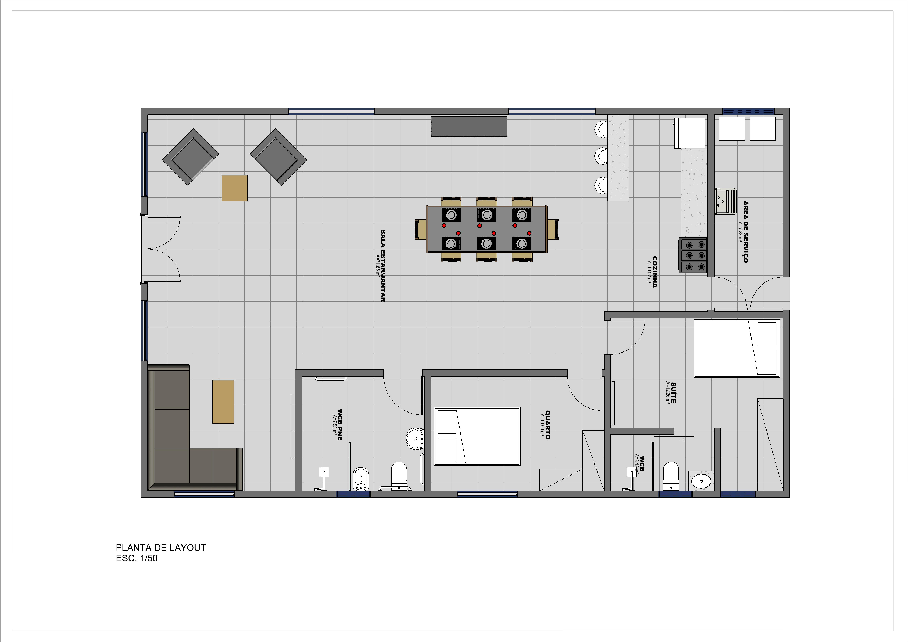

# Apartamento-inteligente-Projeto-INOVATIONN-PARADISE
## Projeto colegial mostrado na startup Hackathon Maceio/al

  

> Esse é meu primeiro repositorio no GITHUB
Esse foi um projeto que foi designado para um projeto de feira de ciencia da 
minha escola, acabou que dando certo, minha turma ficou em primeiro lugar e acabei participando de uma startup de minha cidade e estou disponibizando o codigo e atualizações sobre o projeto :)

Esse projeto consiste em um prototipo para uma planta de apartamento espeficamente dedidaca para pessoas que possuem deficiencia visual, e existem sensores 
ultrasonicos que servem para detectar alguem entre o vão da porta, e nisso quando o sensor detecta mostra uma mensagem no console que foi detectado e fazer 
barulhos sonoros com um buzzer e essa informação sera enviado via blueetooth para o aplicativo

